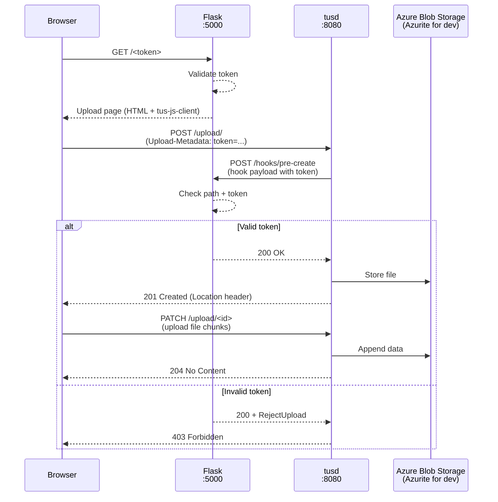
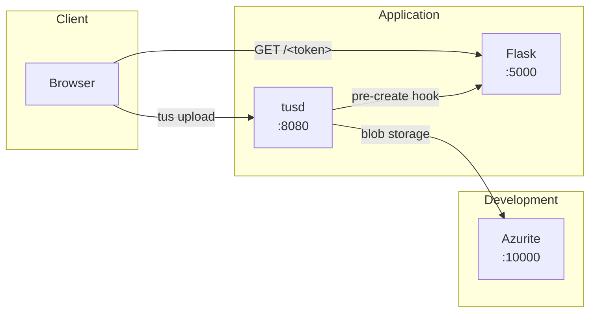
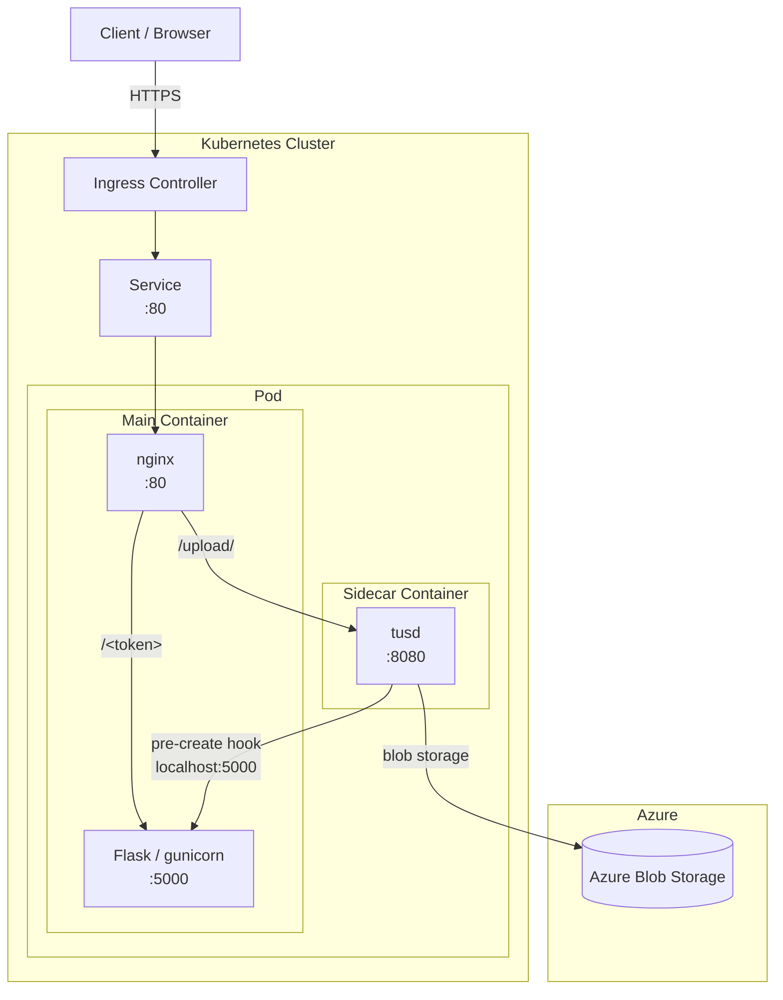

# pooortal

Minimal Python Flask application that processes a [tusd](https://github.com/tus/tusd)
`pre-create` hook to validate a token in the upload metadata **and** restrict
uploads to the `/upload/` path.

## Architecture





### Kubernetes deployment



## How it works

[tusd](https://github.com/tus/tusd) supports lifecycle hooks that are called at
various points during an upload. The `pre-create` hook is invoked **before** an
upload is created, making it the ideal place to authenticate and authorise the
request.

The hook processor performs two checks in order:

1. **Path check** – the upload is only accepted when the client's original
   request URI starts with `/upload/` (read from `HTTPRequest.URI` in the hook
   payload). Any other path is rejected with **HTTP 403**.

2. **Token check** – the client must include a `token` field in the
   `Upload-Metadata` header. The token is validated against the `VALID_TOKENS`
   environment variable (comma-separated list). An invalid or missing token is
   rejected with **HTTP 401**.

| Condition | Response |
|---|---|
| URI does not start with `/upload/` | `403 Forbidden` |
| Token missing or not in `VALID_TOKENS` | `401 Unauthorized` |
| Path and token both valid | `200 OK` |

## Setup

```bash
pip install -r requirements.txt
```

## Running

```bash
# Optional: supply your own comma-separated list of valid tokens
export VALID_TOKENS="my-secret,another-secret"

# Optional: URL of the tusd upload endpoint shown to the browser frontend
# (default: http://localhost:1080/upload/)
export TUSD_URL="http://localhost:1080/upload/"

python app.py
# Flask server starts on http://127.0.0.1:5000
```

Open **http://127.0.0.1:5000/** in a browser to use the upload frontend.

## Configuring tusd

Start tusd with `/upload/` as the base path and point the `pre-create` hook at
the Flask server. Note: tusd CORS flags use regex patterns, not wildcards:

```bash
tusd -base-path /upload/ \
  -hooks-http http://127.0.0.1:5000/hooks/pre-create \
  -cors-allow-origin '.*' \
  -cors-allow-methods 'GET, HEAD, PUT, PATCH, POST, DELETE, OPTIONS' \
  -cors-allow-headers '.*' \
  -cors-expose-headers 'Upload-Offset, Upload-Length, Location'
```

The `-cors-allow-origin '.*'` flag (regex pattern, not wildcard) allows any origin for testing.

## Browser frontend

Navigating to `/` serves a single-page upload form.  Enter your upload token
and choose a file – the page uses
[tus-js-client](https://github.com/tus/tus-js-client) to perform a resumable
upload directly to the tusd server and shows a live progress bar.

The tusd endpoint the frontend uploads to is set by the `TUSD_URL` environment
variable (default `http://localhost:1080/upload/`).

## Client example (curl)

Use any tus-compatible client and pass the token as upload metadata:

```bash
curl -X POST http://localhost:1080/upload/ \
  -H "Tus-Resumable: 1.0.0" \
  -H "Upload-Length: $(wc -c < /path/to/file)" \
  -H "Upload-Metadata: token $(echo -n 'my-secret' | base64)"
```

## Hook payload

tusd sends a JSON body like the following to the hook endpoint:

```json
{
  "HTTPRequest": {
    "Method": "POST",
    "URI": "/upload/",
    "RemoteAddr": "127.0.0.1:12345",
    "Header": {}
  },
  "Upload": {
    "ID": "",
    "Size": 1024,
    "Offset": 0,
    "MetaData": {
      "token": "my-secret"
    },
    "Storage": null
  }
}
```
